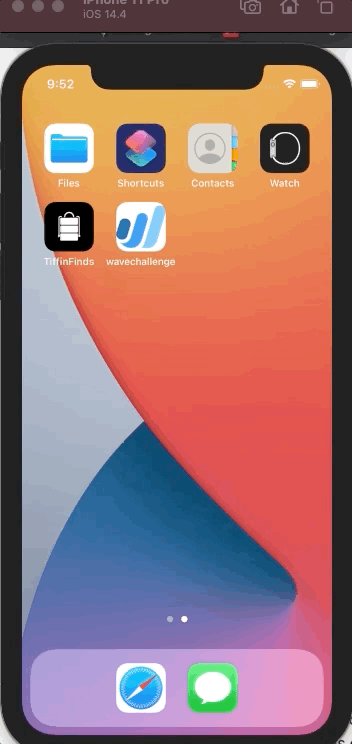
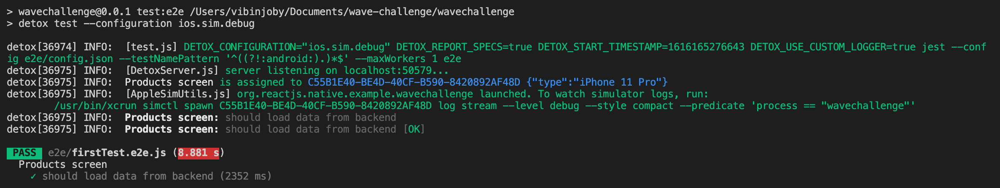

# Wave Software Development Challenge

# 1. Happy path
Below gif displays how the data is loaded from the api, I have added a activity indicator to show the spinner and once the data is loaded, data is rendered in a flatlist in a component called ItemList
# 2. No internet scenario
Below gif also displays how the screen looks like when there is no internet, and how the screen looks like the when the internet is turned on

# 2. Negative path
Below gif displays how the toast appears with a predefined error message if the api doesnt return the expected data or something goes wrong in the backend

# 3. Detox testing

# React Native Documentation for Wave challenge:

## What is the global state management used?
Redux and redux thunk along with @reduxjs/toolkit to avoid a lot of boiler plate code for creating actions, types and reducer

## How does the reducer architecture look like in this app?
rootReducer.js under store/reducers bundles three reducers majorly, products for storing the products in the store and the next two are utility reducers namely loader for showing spinner and toaster for showing toast messages

## How is api called from front-end?
I have created a custom middleware called api under the store/middleware folder which lets me couple three actions together when i call an api from HttpService.js under network folder(under the hood uses axios.js library), first it dispatches an action to indicate that the loader has started and next after response returns, another action is dispatched for onSuccess action which is passed as argument to the middleware, if there is an error, another action is dispatched to show a toast message indicating an error occurred and finally the another action dispatched to hide the loader

# What am I proud about this challenge?
The way i was able to couple utility reducers like toast and loader using redux and making it seamless and easier while coding and when the app scales up, this becomes a lot easier to maintain

## Challenge while building this app?
the only challenge i faced throught the app while building was the url for the api, where it doesnt work or wouldnt give an expected response if no backlash is appended at the end and instead throws {"error":{"message":"Authentication credentials were not provided."}} although token is provided in the header and verified through axios's interceptor to check what request is passed to the backend

Works --> https://api.waveapps.com/businesses/89746d57-c25f-4cec-9c63-34d7780b044b/products/

Doesnt work --> https://api.waveapps.com/businesses/89746d57-c25f-4cec-9c63-34d7780b044b/products

This happens only while calling from axios, while it works when using CURL / calling it from postman, but I consider this as a good learning and a challenge

# Configuration for detox e2e testing
1. Change the binary path for both android/iOS under .detoxrc.json depending on the platform which you run
2. Change the test:e2e and test:e2e:build script in package.json under scripts object, currently set only for iOS
